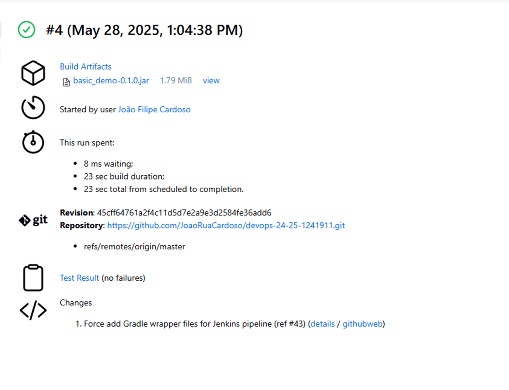
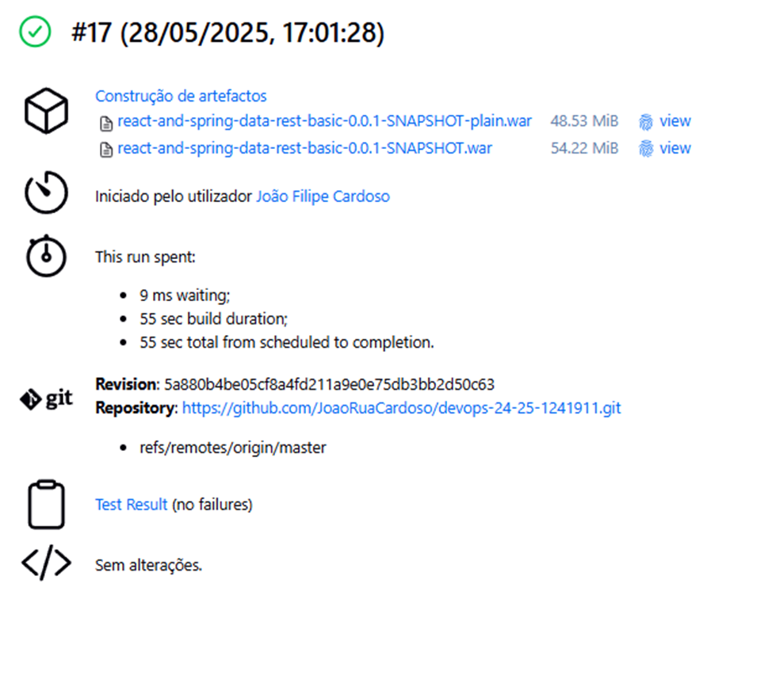

# CA3: Jenkins-Based CI/CD Pipelines

**Author:** João Cardoso  
**Date:** 01/06/2025  
**Discipline:** DevOps  
**Program:** SWitCH DEV  
**Institution:** Instituto Superior de Engenharia / Instituto Politécnico do Porto

## Table of Contents

- [Overview](#overview)
- [Tools and Setup](#tools-and-setup)
- [Part 1: CI/CD Pipeline for Gradle Application](#part-1-cicd-pipeline-for-gradle-application)
- [Part 2: CI/CD Pipeline for React and Spring Data REST Application](#part-2-cicd-pipeline-for-react-and-spring-data-rest-application)
- [Summary](#summary)

## Overview

This task involved configuring CI/CD pipelines with Jenkins for two previously developed applications. The first was a simple Java application using Gradle (`CA1/Part2`), and the second was a combined React and Spring Boot application with RESTful data support (`CA1/Part3`).  
The purpose was to apply core CI/CD practices by leveraging Jenkins to automate stages such as build, test, and deployment. This document explains the configuration and implementation process in detail.

## Tools and Setup

To properly run the pipelines, the following tools were required:

- **Git** – for managing and cloning repositories
- **Docker** – for containerizing and running applications
- **Jenkins** – the central automation server used for building and deploying
- I verified tool availability using the following:
  ```bash
  git --version  
  docker --version
  ```
Instead of installing Jenkins directly, I used Docker to run a Jenkins container locally. I used the following command to start it:

```bash
docker run -d --name jenkins \
  -p 8080:8080 -p 50000:50000 \
  -v jenkins_home:/var/jenkins_home \
  -v /var/run/docker.sock:/var/run/docker.sock \
  jenkins/jenkins:lts
```

Jenkins was then accessible through the browser at http://localhost:8080 for further setup and job configuration.

## Part 1: CI/CD Pipeline for Gradle Application

The first pipeline handles a basic Java Gradle project. 
The Jenkinsfile located within the project folder outlines the full process:

```groovy
pipeline {
   agent any

   stages {
      stage('Checkout') {
         steps {
            echo 'Checking out from repository'
            git branch: 'master', url: 'https://github.com/JoaoRuaCardoso/devops-24-25-1241911.git'
         }
      }
      stage('Assemble') {
         steps {
            dir('ca1/part2/gradle_basic_demo') {
               echo 'Assembling...'
               sh 'chmod +x gradlew'
               sh './gradlew clean assemble'
            }
         }
      }
      stage('Test') {
         steps {
            dir('ca1/part2/gradle_basic_demo') {
               echo 'Running Tests...'
               sh './gradlew test'
               junit 'build/test-results/test/*.xml'
            }
         }
      }
      stage('Archive') {
         steps {
            dir('ca1/part2/gradle_basic_demo') {
               echo 'Archiving artifacts...'
               archiveArtifacts artifacts: 'build/libs/*.jar', allowEmptyArchive: true
            }
         }
      }
   }
}
```

### Execution

1. Open Jenkins and create a new pipeline job.
2. Choose **Pipeline script from SCM**, set SCM to Git.
3. Add the repository URL and script path:  
   `CA3/gradle_basic_demo/Jenkinsfile`
4. Click **Build Now** to run the pipeline.



## Part 2: CI/CD Pipeline for React and Spring Data REST Application

The second pipeline covers a more advanced full-stack application. 
The Jenkinsfile automates everything from Dockerfile creation to image deployment.

```groovy
pipeline {
   agent any

   environment {
      DOCKER_CREDENTIALS_ID = 'dockerhub-creds-id'
      DOCKER_IMAGE          = 'joaogaranhascardoso/springboot-app'
      DOCKER_REGISTRY       = 'https://index.docker.io/v1/'
      REPO_URL              = 'https://github.com/JoaoRuaCardoso/devops-24-25-1241911.git'
      DOCKER_HOST           = 'tcp://host.docker.internal:2375'
   }

   stages {
      stage('Checkout') {
         steps {
            echo 'Checking out...'
            git branch: 'master', url: env.REPO_URL
         }
      }

      stage('Create Dockerfile') {
         steps {
            dir('ca1/part3/react-and-spring-data-rest-basic') {
               echo 'Writing Dockerfile...'
               script {
                  writeFile file: 'Dockerfile', text: '''
FROM eclipse-temurin:17-jdk
WORKDIR /app
COPY build/libs/*.jar app.jar
EXPOSE 8080
ENTRYPOINT ["java","-jar","app.jar"]
'''
               }
            }
         }
      }

      stage('Assemble') {
         steps {
            dir('ca1/part3/react-and-spring-data-rest-basic') {
               echo 'Assembling...'
               sh 'chmod +x gradlew'
               sh './gradlew clean assemble'
            }
         }
      }

      stage('Test') {
         steps {
            dir('ca1/part3/react-and-spring-data-rest-basic') {
               echo 'Testing...'
               sh './gradlew test'
               junit '**/build/test-results/**/*.xml'
            }
         }
      }

      stage('Javadoc') {
         steps {
            dir('ca1/part3/react-and-spring-data-rest-basic') {
               echo 'Generating Javadoc…'
               sh './gradlew javadoc'
               publishHTML(target: [
                       allowMissing: false,
                       alwaysLinkToLastBuild: true,
                       keepAll: true,
                       reportDir: 'build/docs/javadoc',
                       reportFiles: 'index.html',
                       reportName: 'Javadoc'
               ])
            }
         }
      }

      stage('Archive') {
         steps {
            dir('ca1/part3/react-and-spring-data-rest-basic') {
               echo 'Archiving...'
               archiveArtifacts artifacts: 'build/libs/*.war', fingerprint: true
            }
         }
      }

      stage('Build Docker Image') {
         steps {
            dir('ca1/part3/react-and-spring-data-rest-basic') {
               echo 'Building & Pushing Docker image...'
               script {
                  def app = docker.build("${env.DOCKER_IMAGE}:${env.BUILD_NUMBER}", '.')
                  docker.withRegistry(env.DOCKER_REGISTRY, env.DOCKER_CREDENTIALS_ID) {
                     app.push()
                  }
               }
            }
         }
      }
   }

   post {
      always {
         cleanWs()
      }
   }
}

```

### Setup and Execution

- Configure Docker Hub credentials in Jenkins under:  
  *Manage Jenkins → Credentials → Global → Add Credentials*
- Create a new pipeline job pointing to:  
  `CA3/react-and-spring-data-rest-basic/Jenkinsfile`
- Click **Build Now** to execute the process.



## Summary

This project offered practical insight into building CI/CD pipelines using Jenkins for both a standalone backend and a full-stack solution.  
By scripting each stage of the workflow—from build to Docker image deployment—I learned to automate the development lifecycle efficiently, reducing manual errors and speeding up delivery.

[Back to top](#ca3-jenkins-based-cicd-pipelines)
